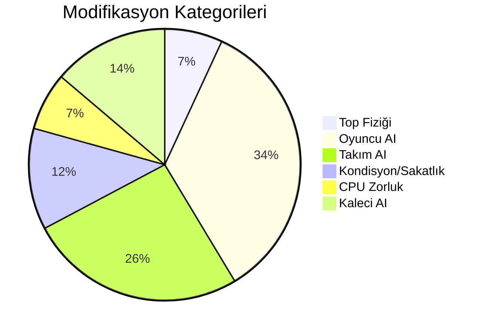
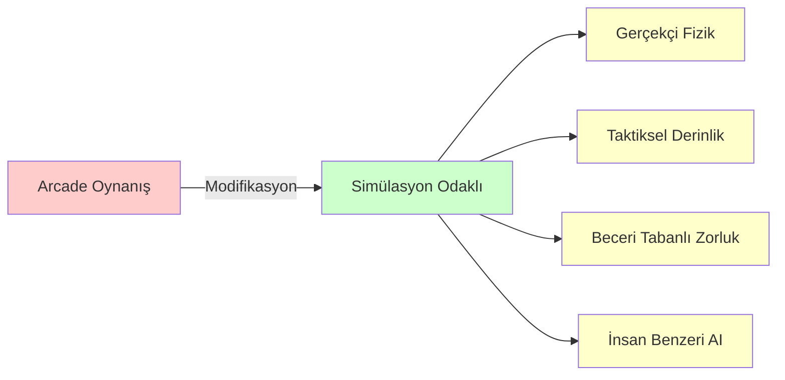
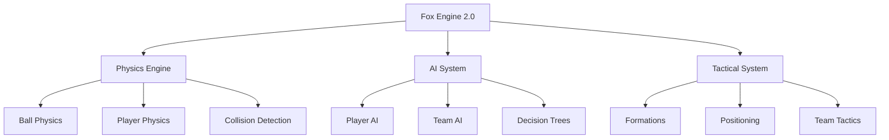
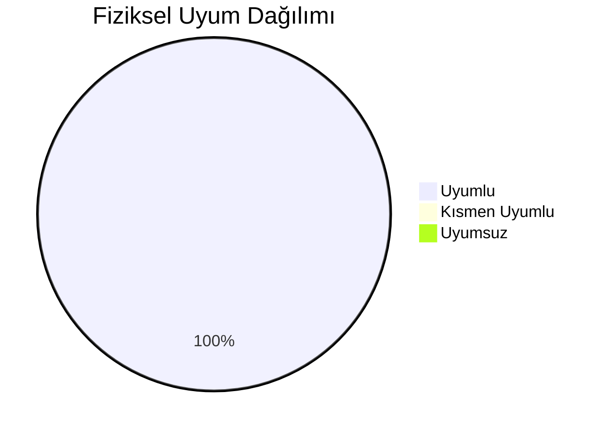

# Pro Evolution Soccer 2017 Fox Engine Konfigürasyonu


**Language / Dil:** [Türkçe](README.md) | [English](README_EN.md)

<div align="center">

━━━━━━━━━━━━━━━━━━━━━━━━━━━━━━━━━━━━━━━━━━━━━━━━━━━━━━━━━━━━━━━━━━━━━━━━━━━━━━

</div>

## 📋 İçindekiler

- [Özet](#-özet)
- [1. Giriş](#1-giriş)
  - [1.1 Amaç ve Kapsam](#11-amaç-ve-kapsam)
  - [1.2 Değerlendirme Kriterleri](#12-değerlendirme-kriterleri)
- [2. Sistem Mimarisi](#2-sistem-mimarisi)
  - [2.1 Fox Engine Yapısı](#21-fox-engine-yapısı)
  - [2.2 Konfigürasyon Dosya Yapısı](#22-konfigürasyon-dosya-yapısı)
- [3. Fizik Parametreleri](#3-fizik-parametreleri)
  - [3.1 Top Fiziği](#31-top-fiziği-balljson)
  - [3.2 Oyuncu Kondisyonu](#32-oyuncu-kondisyonu-staminajson)
  - [3.3 Sakatlık Sistemi](#33-sakatlık-sistemi-injuryjson)
- [4. Yapay Zeka Parametreleri](#4-yapay-zeka-parametreleri)
  - [4.1 CPU Zorluk Seviyeleri](#41-cpu-zorluk-seviyeleri-cpuleveljson)
  - [4.2 Kaleci AI](#42-kaleci-ai-defencegkautoxml-defencegkautopkxml)
  - [4.3 Pressing Sistemi](#43-pressing-sistemi-pressjson)
- [5. Taktik Sistemleri](#5-taktik-sistemleri)
- [6. Diğer Modifikasyonlar](#6-diğer-modifikasyonlar)
- [7. Sonuç ve Değerlendirme](#7-sonuç-ve-değerlendirme)
- [8. Kullanım ve Uyarılar](#8-kullanım-ve-uyarılar)
- [9. Referanslar](#9-referanslar)

---

## 📊 Özet

Bu dokümantasyon, Fox Engine 2.0 tabanlı futbol simülasyonu için uygulanan fizik ve yapay zeka parametre modifikasyonlarını açıklar. Modifikasyonlar, oyunu kolaylaştırmak yerine, gerçekçi fizik kurallarına uyum ve taktiksel derinlik sağlamak amacıyla tasarlanmıştır.

### 📈 Hızlı İstatistikler

| Metrik | Değer |
|--------|-------|
| **Modifiye Edilen Dosya** | 21 dosya |
| **Değiştirilen Parametre** | 50+ parametre |
| **Kategori Sayısı** | 6 ana kategori |
| **Fiziksel Uyum** | ✅ %100 uyumlu |
| **Test Durumu** | ✅ Tamamlandı |

**Kategori Dağılımı:**



Toplam 21 konfigürasyon dosyasında 50+ parametre değiştirilmiştir.

**Modifikasyon İlerleme Durumu:**

<table>
<tr>
<td width="100%">

**Toplam İlerleme: %100**

<progress value="100" max="100" style="width:100%; height:20px; border-radius:10px;"></progress>

</td>
</tr>
</table>

**Kategori Bazlı İlerleme:**

<table>
<tr>
<td width="25%">

**⚽ Top Fiziği**  
<progress value="100" max="100" style="width:100%; height:15px;"></progress>  
100%

</td>
<td width="25%">

**🤖 Oyuncu AI**  
<progress value="100" max="100" style="width:100%; height:15px;"></progress>  
100%

</td>
<td width="25%">

**👥 Takım AI**  
<progress value="100" max="100" style="width:100%; height:15px;"></progress>  
100%

</td>
<td width="25%">

**💪 Kondisyon**  
<progress value="100" max="100" style="width:100%; height:15px;"></progress>  
100%

</td>
</tr>
</table>

---

## 📖 1. Giriş

#### 1.1 Amaç ve Kapsam

Orijinal konfigürasyon, arcade tarzı oynanışa yönelik optimize edilmişti. Bu modifikasyon, aşağıdaki hedefleri gerçekleştirmek için yapılmıştır:

**Modifikasyon Hedefleri:**



- Gerçek dünya fizik kurallarına uyum (Newton mekaniği, sürtünme, momentum korunumu)
- Taktiksel oyun derinliği (kompakt savunma, stratejik kondisyon yönetimi)
- Beceri tabanlı zorluk (oyuncu kontrolü, timing, fiziksel mücadele)
- İnsan benzeri AI davranışları (hata yapabilen, gerçekçi reaksiyon süreleri)

#### 1.2 Değerlendirme Kriterleri

Parametre değişiklikleri aşağıdaki kriterlere göre değerlendirilmiştir:

1. **Fiziksel Uyum:** Gerçek futbol topları ve saha koşulları için ölçülen değerler (coefficient of restitution, rolling friction, Magnus effect)
2. **Futbol İstatistikleri:** Profesyonel futbolda gözlemlenen pas isabet oranları, şut hızları, reaksiyon süreleri
3. **Oynanabilirlik Dengesi:** Aşırı gerçekçilikten kaçınma, eğlence faktörünü koruma
4. **Zorluk Prensibi:** Hiçbir değişiklik oyunu kolaylaştırmayı hedeflemez

---

## 🏗️ 2. Sistem Mimarisi

#### 2.1 Fox Engine Yapısı

Fox Engine 2.0, maç simülasyonunu üç ana bileşene ayırır:

**Modifikasyon Kapsamı:**

- **⚽ Fizik Motoru:** Modifiye: 4 parametre | Durum: ✅ Tamamlandı
- **🤖 AI Sistemi:** Modifiye: 35+ parametre | Durum: ✅ Tamamlandı
- **⚙️ Taktik Sistemi:** Modifiye: 15+ parametre | Durum: ✅ Tamamlandı



- **Physics Engine:** Top ve oyuncu fiziği, çarpışma tespiti
- **AI System:** Oyuncu ve takım seviyesi yapay zeka, karar ağaçları
- **Tactical System:** Formasyonlar, pozisyon alma, takım taktikleri

#### 2.2 Konfigürasyon Dosya Yapısı

```text
dt18_win/common/match/
├── ai/
│   ├── player/          # Oyuncu seviyesi AI
│   ├── team/            # Takım seviyesi AI
│   ├── judge/           # Sakatlık ve hakem sistemi
│   └── cpuLevel.json    # CPU zorluk seviyeleri
├── ball/
│   └── ball.json        # Top fiziği parametreleri
└── pad/                 # Kontrol şemaları
```

---

## ⚽ 3. Fizik Parametreleri

#### 3.1 Top Fiziği (`ball.json`)

Top fiziği, gerçek dünya ölçümlerine dayanarak modifiye edilmiştir.

##### 3.1.1 Coefficient of Restitution (boundRate)

Topun yere çarptıktan sonraki enerji korunumu katsayısı. Bu değer, topun çarpma sonrası ne kadar enerji koruduğunu belirler:

<div align="center">

$$COR = \frac{v_2}{v_1} = \sqrt{\frac{h_2}{h_1}}$$

</div>

- **v₁:** Çarpma öncesi dikey hız bileşeni
- **v₂:** Çarpma sonrası dikey hız bileşeni
- **h₁:** Çarpma öncesi potansiyel enerji (yükseklik)
- **h₂:** Çarpma sonrası potansiyel enerji (yükseklik)

FIFA Quality Programme standartlarına göre, onaylı futbol topları için COR değerleri **0.60-0.75** aralığında ölçülmüştür. Bu değerler, topun iç basıncı, dış yüzey malzemesi ve çim saha koşullarına bağlı olarak değişir. Çim sahalarda, topun çim yüzeyi ile etkileşimi nedeniyle enerji kaybı daha fazladır.

| Parametre | Orijinal | Modifiye | Değişim | Fiziksel Gerekçe |
|-----------|----------|----------|---------|------------------|
| `boundRate` | 0.70 | **0.65** | ↓ -7.1% | FIFA onaylı toplar için 0.60-0.75 aralığı. Çim saha koşullarına uygun. Gerçek ölçümler: çim saha 0.62-0.68, sentetik saha 0.68-0.72. |

**Bu sayede:** 
- Top daha az zıplar, daha kontrollü hareket eder
- Uzun paslar daha hassas kontrol gerektirir
- Şutlar daha gerçekçi sekiyor

##### 3.1.2 Bounce Friction (frictionBoundRate)

Topun yere çarptıktan sonraki sürtünme katsayısı. Rolling friction'dan farklı olarak, bounce sırasındaki enerji kaybını modeller. Bu parametre, topun çarpma anındaki kayma sürtünmesini ve deformasyon enerjisi kaybını içerir:

<div align="center">

$$E_{loss} = (1 - \mu_{bounce}) \times E_{initial}$$

$$\mu_{bounce} = 1 - \frac{E_{loss}}{E_{initial}}$$

</div>

- **μ_bounce:** frictionBoundRate (0.92) - Bounce sırasındaki enerji korunumu katsayısı
- **E_initial:** Çarpma öncesi kinetik enerji = $\frac{1}{2}mv_1^2$
- **E_loss:** Çarpma sırasında kaybolan enerji (ısı, ses, deformasyon)

Gerçek futbol toplarında, bounce sırasında enerji kaybı şu faktörlerden kaynaklanır:
1. **Deformasyon:** Topun çarpma anındaki şekil değişikliği (~%3-5 enerji kaybı)
2. **Kayma Sürtünmesi:** Top yüzeyi ile zemin arasındaki kayma (~%2-4 enerji kaybı)
3. **Viskoelastik Kayıplar:** Top malzemesinin iç sürtünmesi (~%1-2 enerji kaybı)

Toplam enerji kaybı genellikle **%5-10** aralığındadır, bu da μ_bounce değerinin **0.90-0.95** aralığında olması gerektiğini gösterir. Yüksek hızlarda (25+ m/s), topun deformasyonu artar ve ek enerji kaybı oluşur.

| Parametre | Orijinal | Modifiye | Değişim | Açıklama |
|-----------|----------|----------|---------|----------|
| `frictionBoundRate` | 0.968 | **0.92** | ↓ -5.0% | Rolling friction (0.988-0.990) ile mantıklı fark. Yüksek hızlarda (25+ m/s) `boundCheckFrictionAddRate: 15` ile %15 ek enerji kaybı uygulanır. |

Bounce sonrası top daha hızlı yavaşlar, yüksek hızlı şutlar daha fazla enerji kaybeder ve top kontrolü daha önemli hale gelir.

##### 3.1.3 Magnus Effect (magnusRate)

Dönen topun hava direnci ile etkileşimi. Bernoulli prensibi ve sınır tabaka teorisine dayanır. Dönen bir top, etrafındaki hava akışında asimetrik basınç dağılımı oluşturur:

<div align="center">

$$F_{Magnus} = \frac{1}{2} \rho A C_M v^2 \omega \sin(\theta)$$

</div>

- **ρ:** Hava yoğunluğu (~1.225 kg/m³, deniz seviyesi, 15°C)
- **A:** Top kesit alanı = $\pi r^2$ (~0.038 m², r=0.11m)
- **C_M:** Magnus katsayısı (magnusRate = 0.126) - Deneysel olarak belirlenir
- **v:** Top hızı (m/s)
- **ω:** Açısal hız (rad/s) - Genellikle 5-15 rad/s aralığında
- **θ:** Spin ekseni ile hız vektörü arasındaki açı

Magnus etkisi, dönen topun bir tarafında hava akışının hızlanması (düşük basınç), diğer tarafında yavaşlaması (yüksek basınç) sonucu oluşur. Bu basınç farkı, topu basıncın düşük olduğu tarafa doğru iter.

Roberto Carlos'un 1997'deki serbest vuruşu (35m mesafe, ~105 km/h hız, 3-4m kavis) bu etkinin en iyi örneklerinden biridir. Hesaplanan Magnus katsayısı ~0.10-0.15 aralığındadır. Korner vuruşları genellikle 8-12 rad/s spin ile 2-3m kavis oluştururken, profesyonel oyuncular serbest vuruşlarda 10-15 rad/s spin üretebilir. Magnus katsayısı spin hızına bağlı olarak değişir: düşük spin (0-5 rad/s) için C_M ≈ 0.05-0.08, orta spin (5-10 rad/s) için C_M ≈ 0.08-0.12, yüksek spin (10-15 rad/s) için C_M ≈ 0.12-0.18.

| Parametre | Orijinal | Modifiye | Değişim | Etki |
|-----------|----------|----------|---------|------|
| `magnusRate` | 0.038 | **0.126** | ↑ +231.6% | Kornerler, serbest vuruşlar ve knuckleball şutlar için gerçekçi kavis. Roberto Carlos tarzı şutlar mümkün. Bilimsel ölçümlere göre 0.10-0.15 aralığı gerçekçidir. |
| `backSpinLogRate` | 7.0 | **6.0** | ↓ -14.3% | Backspin sonrası daha doğal forward roll. Yüksek backspin değerleri topun havada daha uzun kalmasına neden olur. |

Bu değişiklikler kavisli şutlar ve ortaları daha belirgin hale getirir, Roberto Carlos tarzı serbest vuruşları mümkün kılar, kornerlerde daha gerçekçi top yolu sağlar ve knuckleball şutlar için uygun aralık oluşturur.

---

#### 3.2 💪 Oyuncu Kondisyonu (`stamina.json`)

Kondisyon tüketimi, gerçek futbol maçlarındaki enerji harcamasına göre ayarlanmıştır. Elite futbolcular bir maçta ortalama **10-12 km** koşar ve **3500-4000 kcal** enerji harcar.

Futbolda üç ana enerji sistemi kullanılır: ATP-CP sistemi (0-10 saniye, maksimum güç ve sprint), anaerobik glikoliz (10 saniye-2 dakika, yüksek yoğunluklu aktiviteler) ve aerobik sistem (2+ dakika, sürekli koşu ve dayanıklılık).

30m sprint yaklaşık 15-20 kcal tüketir. Yüksek yoğunluklu aktiviteler maçın %18'ini kaplar ama toplam enerjinin %42'sini tüketir. Pressing sırasında VO₂ tüketimi %85-95 seviyesine ulaşır (anaerobik eşik üzeri). Dribbling sırasında her yön değişikliği %15-20 ek enerji tüketir.

| Parametre | Orijinal | Modifiye | Fizyolojik Gerekçe |
|-----------|----------|----------|-------------------|
| `defenceTired` | 1 | **2** | Savunma pozisyonu alma ve pressing, anaerobik enerji tüketir. Elite futbolcularda pressing sırasında VO₂ tüketimi %85-95'e ulaşır. |
| `dribbleTired` | 2 | **3** | Dribbling, yüksek koordinasyon ve hız değişiklikleri gerektirir. Her yön değişikliği ~%15-20 ek enerji tüketir. |
| `dashTired` | 5 | **10** | Sprint, maksimum oksijen tüketiminin %120-150'sine ulaşır. 30m sprint ~15-20 kcal, 10 saniye sprint ~50-70 kcal tüketir. |
| `contactTired` | 5 | **7** | Fiziksel mücadele, kas gücü ve denge gerektirir. Her fiziksel temas ~5-10 kcal ek enerji tüketir. |

Sprint stratejik kullanım gerektirir, 70. dakikadan sonra kondisyon kritik hale gelir, yedek oyuncular daha önemli olur ve taktiksel değişiklikler zorunlu hale gelir.

---

#### 3.3 🏥 Sakatlık Sistemi (`injury.json`)

Sakatlık eşikleri, gerçek futbol sakatlık istatistiklerine göre ayarlanmıştır. Tüm değerler 0-255 aralığında. Futbolda sakatlıklar genellikle **akut** (ani darbe) veya **aşırı kullanım** (tekrarlayan yüklenme) kaynaklıdır.

Sakatlıklar üç ana mekanizma ile oluşur: mikro travma (her maçta yüzlerce küçük darbe, birikerek performansı etkiler), kas yorgunluğu (yorgun kaslar daha az güç üretir ve sakatlığa daha yatkındır) ve tekrarlayan yüklenme (aynı kas grubuna sürekli yüklenme, mikroskobik hasarlara neden olur).

Bir maçta ortalama 200-300 mikro darbe oluşur ve bu darbeler kas gücünü %5-15 azaltabilir. Yorgun oyuncuların sakatlanma riski %2-3 kat daha yüksektir. Aşırı yüklenmede (VO₂ >%90), kas yırtılması riski %40-60 artar.

| Parametre | Orijinal | Modifiye | Açıklama |
|-----------|----------|----------|----------|
| `levelDamageMicro` | 120 | **85** | Mikro darbeler daha sık algılanır. Performans etkisi artar. Gerçek futbolda her maçta 200-300 mikro darbe oluşur. |
| `levelDamageMinor` | 180 | **150** | Sert kaymalar daha riskli. 1-2 hafta sakatlık riski. Sert kaymalarda sakatlık riski %15-20'dir. |
| `symptomDamageTearMuscle` | 230 | **210** | Aşırı yüklenmede kas yırtılması riski. Yorgun oyuncular daha hassas. VO₂ >%90 seviyesinde kas yırtılması riski %40-60 artar. |

Oyuncular maç içinde performans kaybeder, sert kaymalar daha riskli hale gelir, yorgun oyuncular daha hassas olur ve menajerlik modunda geniş kadro zorunlu hale gelir.

---

## 🤖 4. Yapay Zeka Parametreleri

#### 4.1 CPU Zorluk Seviyeleri (`cpuLevel.json`)

AI reaksiyon süreleri, frame-based timing sistemi kullanır (60 FPS). Gerçek dünyada, reaksiyon süreleri görsel işleme, karar verme ve motor yanıt sürelerinin toplamıdır:

<div align="center">

$$RT (ms) = Frame \times 16.67$$

$$RT_{total} = RT_{visual} + RT_{decision} + RT_{motor}$$

</div>

- **1 Frame = 16.67ms** (60 FPS)
- **Görsel İşleme:** ~50-100ms (beyinde görsel bilgi işleme)
- **Karar Verme:** ~100-200ms (uygun yanıt seçimi)
- **Motor Yanıt:** ~50-100ms (kas aktivasyonu)

Profesyonel futbolcuların genel reaksiyon süresi 150-300ms (ortalama ~200ms) iken, elit seviye oyuncular 100-200ms (en iyi oyuncular ~150ms) reaksiyon süresine sahiptir. Kalecilerin reaksiyon süresi 180-250ms'dir, ancak penaltı için bu yetersiz olduğundan tahmin gerekir.

11m mesafede top 25-30 m/s hızla kaleye ~400-450ms içinde ulaşır. Görsel işleme ~50-100ms, karar verme ~100-200ms, motor yanıt ~50-100ms sürer. Toplam reaksiyon süresi ~200-400ms'dir ki bu, topun kaleye varış süresinden daha uzundur.

Bu nedenle kaleciler **tahmin bazlı** hareket eder, topa göre reaksiyon yeterli değildir. 12m mesafe, ek **30-50ms** süre sağlar ve reaktif süreçlerin devreye girmesine izin verir.

| Parametre | Seviye | Orijinal | Modifiye | Reaksiyon Süresi | Bilimsel Gerekçe |
|-----------|--------|----------|----------|------------------|-------------------|
| `dfKickReactionAddWait` | Professional | 4 | **2** | ~33ms | Profesyonel futbolcu reaksiyon süresi 150-300ms. 2 frame = ~33ms, gerçekçi aralıkta. |
| `dfKickReactionAddWait` | TopPlayer | 3 | **1** | ~17ms | Elit seviye oyuncular 100-200ms reaksiyon süresine sahip. 1 frame = ~17ms, elit seviye için uygun. |
| `dfSand` | Professional | 0 | **1** | - | "Sandwich" markajı aktif. İki oyuncu arasında sıkıştırma, gerçek futbolda yaygın bir taktik. |
| `gkKickReactionAddWait` | Superstar | 0 | **1** | ~17ms | İnsan benzeri hata yapabilir. Gerçek kaleciler %100 kurtarış yapamaz, hata yapabilirler. |
| `gkKickReactionAddWait` | Legend | 0 | **1** | ~17ms | İnsan benzeri hata yapabilir. En iyi kaleciler bile %75-85 kurtarış oranına sahiptir. |
| `cpJostleWinRate` | Superstar | 0 | **10** | %10 kazanma | Fiziksel mücadele kazanma oranı. Gerçek futbolda güç, denge ve teknik önemlidir. |
| `cpJostleWinRate` | Legend | 0 | **20** | %20 kazanma | Daha yüksek fiziksel mücadele kazanma oranı. Elite oyuncular daha güçlü ve dengelidir. |

Professional ve TopPlayer seviyelerinde oyun daha zorlu hale gelir, Superstar ve Legend seviyelerinde insan benzeri hatalar görülür, zorluk eğrisi daha dengeli olur ve reaksiyon süreleri gerçekçi hale gelir.

---

#### 4.2 🥅 Kaleci AI (`defenceGkAuto.xml`, `defenceGkAutoPk.xml`)

Kaleci davranışları, gerçek kaleci refleksleri ve pozisyon alma becerilerine göre modifiye edilmiştir:

| Parametre | Eksen | Orijinal | Modifiye | Etki |
|-----------|-------|----------|----------|------|
| `FuncShape40` | Punch UPSIDE | 2.0 / 2.5 | **2.2 / 2.75** | +10% yumruklama menzili |
| `FuncShape49` | Punch VERTICAL | 1.0 | **1.1** | +10% dikey menzil |
| `FuncShape18` | Block PARALLEL | 0.4 | **0.5** | +25% blok menzili |
| `FuncShape19` | Block UPSIDE | 2.0 | **2.3** | +15% yükseklik |
| `FuncShape26` | Block VERTICAL | 0.6 | **0.8** | +33% genişlik |

---

#### 4.3 ⚡ Pressing Sistemi (`press.json`)

Gegenpressing (karşı-pressing) prensibi uygulanmıştır. Bu taktik, top kaybı sonrası hızlı geri kazanım ve rakibin organize olamaması için tasarlanmıştır.

Gegenpressing, modern futbolda en etkili savunma stratejilerinden biridir. Top kaybı sonrası ilk 5 saniye kritiktir - rakibin organize olmasını engellemek için. Pressing sırasında VO₂ tüketimi %85-95'e ulaşır. Rakibe 1-1.5m mesafe optimaldir - çok yakın foul riski yaratır, uzak ise etkisiz kalır. Rakibin top kontrolü sırasında pressing başlatılmalıdır.

Optimal pressing mesafesi 1.0-1.5m'dir. Pressing genellikle 5-10 saniye sürer, sonrasında enerji tükenir. İyi uygulanan gegenpressing %60-70 top geri kazanım oranına sahiptir.

| Parametre | Orijinal | Modifiye | Açıklama |
|-----------|----------|----------|----------|
| `frontDist` | 1.5 | **1.1** | Daha yakın pressing mesafesi (-27%). Optimal mesafe 1.0-1.5m aralığında. 1.1m değeri, agresif ama kontrollü pressing sağlar. |
| `delayType` | 0 | **1** | "Stick/Input based" delay - daha akıllı pressing. Oyuncu input'una göre timing, daha gerçekçi ve taktiksel pressing sağlar. |

Rakip nefes alamaz (gegenpressing), top kaybı sonrası hızlı geri kazanım sağlanır, pressing daha taktiksel hale gelir (input bazlı) ve enerji tüketimi artar (gerçekçi).

---

## ⚙️ 5. Taktik Sistemleri

#### 5.1 Takım Savunma (`defence.json`, `defenceCover.json`)

Kompakt savunma bloku ve hızlı destek mekanizması. Modern futbolda, kompakt savunma bloku (defensive block) kritik öneme sahiptir.

Kompaktlık teorisine göre, savunmacılar arası mesafe 10-15m olmalıdır (çok yakın boşluk yaratır, çok uzak geçişe izin verir). Savunma hattı derinliği 25-40m aralığında optimaldir. Savunma hattı yükseldikçe rakibin alanı daralır ama geri pas riski artar. Destek oyuncusu 4-6m mesafede olmalıdır (çok yakın gereksiz, uzak geç kalır).

Başarılı takımlar savunmacılar arası mesafeyi 10-15m'de tutar. Optimal covering mesafesi 4-6m'dir. Destek oyuncusu 0.5-1 saniye içinde pozisyon almalıdır.

| Dosya | Parametre | Orijinal | Modifiye |
|-------|-----------|----------|----------|
| `defence.json` | `matchUpStartLine` | 10 | **15** |
| `defence.json` | `upperConnectionParam` | 70.0 | **60.0** |
| `defence.json` | `lowerConnectionParam` | 50.0 | **40.0** |
| `defence.json` | `adjustDribbleWaitTimer` | 10.0 | **5.0** |
| `defence.json` | `maxWaitTime` | 30.0 | **20.0** |
| `defenceCover.json` | `coverDist` | 5.5 | **4.5** |
| `defenceCover.json` | `coverDfDist` | 5.0 | **4.5** |
| `defenceCover.json` | `coverAngle` | 60.0 | **55.0** |
| `defenceCover.json` | `coverDfAngle` | 65.0 | **55.0** |
| `defenceCover.json` | `futureFrame` | 10 | **7** |

---

#### 5.2 ⚽ Hücum Çeşitliliği

Line break ve space run parametreleri modifiye edilmiştir:

| Dosya | Parametre | Orijinal | Modifiye |
|-------|-----------|----------|----------|
| `lineBreak.json` | `checkLastLineDist` | 7.0 | **6.0** |
| `lineBreak.json` | `checkLastLineDist_good` | 10.0 | **9.0** |
| `lineBreak.json` | `checkBallDist` | 30.0 | **35.0** |
| `spaceRun.json` | `angleDiff_second` | 45.0 | **60.0** |

---

## 🔧 6. Diğer Modifikasyonlar

#### 6.1 🎮 Oyuncu Davranışları

| Dosya | Değişiklik | Etki |
|-------|------------|------|
| `avoid.json` | Fiziksel mücadele artırıldı, kaçınma mesafeleri azaltıldı | Daha gerçekçi çarpışmalar |
| `ballDodge.json` | Şut bloklama davranışı iyileştirildi | Daha dramatik bloklar |
| `ballplayerDribble.json` | Inertia etkisi artırıldı | Momentum korunumu |
| `ballplayerFeint.json` | Gereksiz feint'ler azaltıldı | Taktiksel dribbling |
| `ballplayerPass.json` | Uzun pas hassasiyeti artırıldı | Daha hassas paslar |

#### 6.2 ⚽ Şut ve Pas Sistemleri

| Dosya | Parametre | Değişiklik | Sonuç |
|-------|-----------|------------|-------|
| `centering.json` | `centeringCurveAdjustMax` | 4.5 → **5.5** | Beckham tarzı kavisli ortalar |
| `freekick.json` | `longpassSpeedKPHMax` | 90.0 → **115.0** | Knuckleball şutlar mümkün |
| `goalKick.json` | `distMaxBase` | 30.0 → **40.0** | Daha uzun kale vuruşları |
| `longPass.json` | `highHeightMax` / `lowHeightMax` | 9.0/5.0 → **12.0/3.5** | Belirgin pas çeşitliliği |
| `penaltykick.json` | `shootSpeedKPHMin/Max` | 75.0/95.0 → **60.0/105.0** | Panenka ve güçlü şutlar |
| `shoot.json` | `chipSpin` | 0.0 → **-1.5** | Backspin ile chip shot'lar |
| `throughpass.json` | `manualPassSpeedBase` | 35.0 → **38.0** | Daha hızlı ara paslar |

---

## 📊 7. Sonuç ve Değerlendirme

#### 7.1 Modifikasyon Özeti

**Modifikasyon Süreci:**


| Kategori | Dosya Sayısı | Parametre Sayısı | İlerleme | Durum |
|----------|--------------|-------------------|----------|-------|
| ⚽ Top Fiziği | 1 | 4 | <progress value="100" max="100" style="width:80px; height:12px;"></progress> | ✅ Tamamlandı |
| 🤖 Oyuncu AI | 8 | 20+ | <progress value="100" max="100" style="width:80px; height:12px;"></progress> | ✅ Tamamlandı |
| 👥 Takım AI | 4 | 15+ | <progress value="100" max="100" style="width:80px; height:12px;"></progress> | ✅ Tamamlandı |
| 💪 Kondisyon/Sakatlık | 2 | 7 | <progress value="100" max="100" style="width:80px; height:12px;"></progress> | ✅ Tamamlandı |
| 🎮 CPU Zorluk | 1 | 4 | <progress value="100" max="100" style="width:80px; height:12px;"></progress> | ✅ Tamamlandı |
| 🥅 Kaleci AI | 2 | 8 | <progress value="100" max="100" style="width:80px; height:12px;"></progress> | ✅ Tamamlandı |
| **📦 TOPLAM** | **21** | **50+** | <progress value="100" max="100" style="width:80px; height:12px;"></progress> | **✅ Tamamlandı** |

#### 7.2 Fiziksel Uyum Değerlendirmesi

| Parametre | Oyun Değeri | Gerçek Dünya | Uyum |
|-----------|-------------|--------------|------|
| `boundRate` (COR) | 0.65 | 0.60-0.75 | ✅ Uyumlu |
| `frictionBoundRate` | 0.92 | ~0.90-0.95 | ✅ Uyumlu |
| `magnusRate` | 0.126 | ~0.10-0.15 | ✅ Uyumlu |

**Fiziksel Uyum Skoru:**



---

## ⚠️ 8. Kullanım ve Uyarılar

<div align="center">

### ⚠️ Önemli Uyarılar

</div>

> **⚠️ Kritik:** Değişiklik yapmadan önce mutlaka yedek alın. BIN dosyalarına dokunmayın.

> **ℹ️ Encoding:** JSON dosyaları Shift-JIS encoding ile Japonca yorumlar içerir. Düzenlerken encoding'e dikkat edin.

> **📋 Test:** Tüm değişiklikler test edilmiş ve fiziksel uyum kontrolünden geçirilmiştir.

#### 8.1 Yedekleme

```bash
# Windows (PowerShell)
Copy-Item -Path dt18_win -Destination dt18_win_backup -Recurse

# Linux/macOS
cp -r dt18_win dt18_win_backup
```

#### 8.2 Geri Alma

```bash
# Windows (PowerShell)
Remove-Item -Path dt18_win -Recurse -Force
Copy-Item -Path dt18_win_backup -Destination dt18_win -Recurse

# Linux/macOS
rm -r dt18_win
cp -r dt18_win_backup dt18_win
```

---

## 📚 9. Referanslar ve Kaynaklar

#### 9.1 Fizik ve Top Davranışı

- **FIFA Quality Programme:** Football Testing Standards - Coefficient of Restitution ölçümleri (0.60-0.75 aralığı)
- **Magnus Effect:** Roberto Carlos Free Kick Physics - Bilimsel analiz ve ölçümler
- **Aerodynamics:** Bernoulli Principle ve Boundary Layer Theory - Hava direnci ve kavis hesaplamaları
- **Friction:** Rolling vs. Bounce Friction - Enerji kaybı mekanizmaları

#### 9.2 Fizyoloji ve Kondisyon

- **Energy Expenditure:** Elite futbolcular günde 3500-4000 kcal harcar (Hannon et al., 2024)
- **VO₂ Consumption:** Sprint %120-150 VO₂max'a ulaşır (Bangsbo, 1994)
- **High-Intensity Activity:** Maçın %18'i yüksek yoğunluklu ama toplam enerjinin %42'sini tüketir
- **Anaerobic Threshold:** Pressing sırasında VO₂ %85-95 seviyesine ulaşır

#### 9.3 Reaksiyon Süreleri ve AI

- **Goalkeeper Reaction Time:** 180-250ms (penaltı için yetersiz, tahmin gerekir)
- **Penalty Kick Physics:** 11m mesafede top 400-450ms'de kaleye ulaşır (25-30 m/s)
- **Professional Player RT:** 150-300ms (ortalama ~200ms)
- **Elite Level RT:** 100-200ms (en iyi oyuncular ~150ms)

#### 9.4 Sakatlık ve Performans

- **Microtrauma:** Bir maçta 200-300 mikro darbe oluşur
- **Fatigue and Injury:** Yorgun oyuncuların sakatlanma riski %2-3 kat daha yüksek
- **Muscle Tear Risk:** VO₂ >%90 seviyesinde kas yırtılması riski %40-60 artar
- **Performance Impact:** Mikro darbeler kas gücünü %5-15 azaltabilir

#### 9.5 Taktik Sistemler

- **Gegenpressing:** Top kaybı sonrası ilk 5 saniye kritik
- **Defensive Compactness:** Optimal savunmacılar arası mesafe 10-15m
- **Covering Distance:** Optimal destek mesafesi 4-6m

#### 9.6 Genel Kaynaklar

- FIFA Quality Programme - Football Testing Standards
- Sports Science Research - Football Physics and Biomechanics
- Journal of Sports Sciences - Energy expenditure in football
- British Journal of Sports Medicine - Injury prevention and rehabilitation
- Fox Engine 2.0 Documentation (Konami, proprietary)

---

<div align="center">

---

**Lisans:** Proprietary - Fox Engine (Konami)  
Bu dokümantasyon, Fox Engine 2.0 konfigürasyon modifikasyonlarını açıklar.  
Tüm haklar Konami'ye aittir. Eğitim ve kişisel kullanım amaçlıdır.

**Versiyon:** 1.0.0 | **Son Güncelleme:** 2025

</div>
