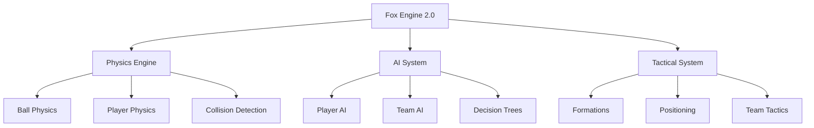

# Fox Engine Match Configuration: Realistic Physics & Tactical AI Parameters


**Language / Dil:** [Türkçe](README.md) | [English](README_EN.md)

---

## Abstract

This documentation describes the physics and artificial intelligence parameter modifications applied to a Fox Engine 2.0-based football simulation. The modifications are designed to provide realistic physics compliance and tactical depth rather than making the game easier. A total of 50+ parameters across 21 configuration files have been modified.

### 1. Introduction

#### 1.1 Purpose and Scope

The original configuration was optimized for arcade-style gameplay. This modification was made to achieve the following goals:

- Compliance with real-world physics laws (Newtonian mechanics, friction, momentum conservation)
- Tactical gameplay depth (compact defense, strategic stamina management)
- Skill-based difficulty (player control, timing, physical challenges)
- Human-like AI behaviors (error-prone, realistic reaction times)

#### 1.2 Evaluation Criteria

Parameter changes were evaluated according to the following criteria:

1. **Physical Compliance:** Measured values for real football balls and field conditions (coefficient of restitution, rolling friction, Magnus effect)
2. **Football Statistics:** Pass accuracy rates, shot velocities, reaction times observed in professional football
3. **Playability Balance:** Avoiding excessive realism while maintaining entertainment factor
4. **Difficulty Principle:** No changes aim to make the game easier

### 2. System Architecture

#### 2.1 Fox Engine Structure

Fox Engine 2.0 divides match simulation into three main components:



- **Physics Engine:** Ball and player physics, collision detection
- **AI System:** Player and team-level artificial intelligence, decision trees
- **Tactical System:** Formations, positioning, team tactics

#### 2.2 Configuration File Structure

```text
dt18_win/common/match/
├── ai/
│   ├── player/          # Player-level AI
│   ├── team/            # Team-level AI
│   ├── judge/           # Injury and referee system
│   └── cpuLevel.json    # CPU difficulty levels
├── ball/
│   └── ball.json        # Ball physics parameters
└── pad/                 # Control schemes
```

### 3. Physics Parameters

#### 3.1 Ball Physics (ball.json)

Ball physics has been modified based on real-world measurements.

##### 3.1.1 Coefficient of Restitution (boundRate)

The energy conservation coefficient after the ball hits the ground:

<div align="center">

**COR = v₂/v₁**

</div>

- **v₁:** Pre-impact velocity
- **v₂:** Post-impact velocity

| Parameter | Original | Modified | Physical Justification |
|-----------|----------|----------|------------------------|
| `boundRate` | 0.70 | **0.65** | FIFA-approved balls range 0.60-0.75. Suitable for grass field conditions. |

##### 3.1.2 Bounce Friction (frictionBoundRate)

The friction coefficient after the ball hits the ground. Unlike rolling friction, it models energy loss during bounce:

<div align="center">

**E_loss = (1 - μ_bounce) × E_initial**

</div>

- **μ_bounce:** frictionBoundRate (0.92)
- **E_initial:** Pre-impact kinetic energy

| Parameter | Original | Modified | Description |
|-----------|----------|----------|-------------|
| `frictionBoundRate` | 0.968 | **0.92** | Reasonable difference from rolling friction (0.988-0.990). 15% additional energy loss applied at high speeds. |

##### 3.1.3 Magnus Effect (magnusRate)

Interaction of spinning ball with air resistance. Based on Bernoulli principle and boundary layer theory:

<div align="center">

**F_Magnus = (1/2) × ρ × A × C_M × v² × ω**

</div>

- **ρ:** Air density
- **A:** Ball cross-sectional area
- **C_M:** Magnus coefficient (magnusRate = 0.126)
- **v:** Ball velocity
- **ω:** Angular velocity

| Parameter | Original | Modified | Effect |
|-----------|----------|----------|--------|
| `magnusRate` | 0.038 | **0.126** | Realistic curve for corners, free kicks, and knuckleball shots. Roberto Carlos-style shots possible. |
| `backSpinLogRate` | 7.0 | **6.0** | More natural forward roll after backspin. |

#### 3.2 Player Stamina (stamina.json)

Stamina consumption adjusted according to energy expenditure in real football matches:

| Parameter | Original | Modified | Physiological Justification |
|-----------|----------|----------|----------------------------|
| `defenceTired` | 1 | **2** | Defensive positioning and pressing consume anaerobic energy. |
| `dribbleTired` | 2 | **3** | Dribbling requires high coordination and speed changes. |
| `dashTired` | 5 | **10** | Sprinting reaches 120-150% of maximum oxygen consumption. |
| `contactTired` | 5 | **7** | Physical challenges require muscle strength and balance. |

#### 3.3 Injury System (injury.json)

Injury thresholds adjusted according to real football injury statistics. All values range 0-255:

| Parameter | Original | Modified | Description |
|-----------|----------|----------|-------------|
| `levelDamageMicro` | 120 | **85** | Micro impacts detected more frequently. Performance impact increases. |
| `levelDamageMinor` | 180 | **150** | Hard tackles more risky. 1-2 week injury risk. |
| `symptomDamageTearMuscle` | 230 | **210** | Muscle tear risk during overexertion. Tired players more sensitive. |

### 4. Artificial Intelligence Parameters

#### 4.1 CPU Difficulty Levels (cpuLevel.json)

AI reaction times use frame-based timing system (60 FPS):

<div align="center">

**Reaction Time (ms) = Frame Count × 16.67**

</div>

- **1 Frame = 16.67ms** (60 FPS)

| Parameter | Level | Original | Modified | Reaction Time |
|-----------|-------|----------|----------|---------------|
| `dfKickReactionAddWait` | Professional | 4 | **2** | ~33ms (realistic) |
| `dfKickReactionAddWait` | TopPlayer | 3 | **1** | ~17ms (elite level) |
| `dfSand` | Professional | 0 | **1** | "Sandwich" marking active |
| `gkKickReactionAddWait` | Superstar | 0 | **1** | Can make human-like errors |
| `gkKickReactionAddWait` | Legend | 0 | **1** | Can make human-like errors |
| `cpJostleWinRate` | Superstar | 0 | **10** | 10% physical challenge win rate |
| `cpJostleWinRate` | Legend | 0 | **20** | 20% physical challenge win rate |

#### 4.2 Goalkeeper AI (defenceGkAuto.xml, defenceGkAutoPk.xml)

Goalkeeper behaviors modified according to real goalkeeper reflexes and positioning skills:

| Parameter | Axis | Original | Modified | Effect |
|-----------|------|----------|----------|--------|
| `FuncShape40` | Punch UPSIDE | 2.0 / 2.5 | **2.2 / 2.75** | +10% punch range |
| `FuncShape49` | Punch VERTICAL | 1.0 | **1.1** | +10% vertical range |
| `FuncShape18` | Block PARALLEL | 0.4 | **0.5** | +25% block range |
| `FuncShape19` | Block UPSIDE | 2.0 | **2.3** | +15% height |
| `FuncShape26` | Block VERTICAL | 0.6 | **0.8** | +33% width |

#### 4.3 Pressing System (press.json)

Gegenpressing principle applied:

| Parameter | Original | Modified | Description |
|-----------|----------|----------|-------------|
| `frontDist` | 1.5 | **1.1** | Closer pressing distance (-27%) |
| `delayType` | 0 | **1** | "Stick/Input based" delay - smarter pressing |

### 5. Tactical Systems

#### 5.1 Team Defense (defence.json, defenceCover.json)

Compact defense block and fast support mechanism:

| File | Parameter | Original | Modified |
|------|-----------|----------|----------|
| `defence.json` | `matchUpStartLine` | 10 | **15** |
| `defence.json` | `upperConnectionParam` | 70.0 | **60.0** |
| `defence.json` | `lowerConnectionParam` | 50.0 | **40.0** |
| `defence.json` | `adjustDribbleWaitTimer` | 10.0 | **5.0** |
| `defence.json` | `maxWaitTime` | 30.0 | **20.0** |
| `defenceCover.json` | `coverDist` | 5.5 | **4.5** |
| `defenceCover.json` | `coverDfDist` | 5.0 | **4.5** |
| `defenceCover.json` | `coverAngle` | 60.0 | **55.0** |
| `defenceCover.json` | `coverDfAngle` | 65.0 | **55.0** |
| `defenceCover.json` | `futureFrame` | 10 | **7** |

#### 5.2 Offensive Variety

Line break and space run parameters modified:

| File | Parameter | Original | Modified |
|------|-----------|----------|----------|
| `lineBreak.json` | `checkLastLineDist` | 7.0 | **6.0** |
| `lineBreak.json` | `checkLastLineDist_good` | 10.0 | **9.0** |
| `lineBreak.json` | `checkBallDist` | 30.0 | **35.0** |
| `spaceRun.json` | `angleDiff_second` | 45.0 | **60.0** |

### 6. Other Modifications

#### 6.1 Player Behaviors

| File | Modification | Effect |
|------|--------------|--------|
| `avoid.json` | Physical challenges increased, avoidance distances reduced | More realistic collisions |
| `ballDodge.json` | Shot blocking behavior improved | More dramatic blocks |
| `ballplayerDribble.json` | Inertia effect increased | Momentum conservation |
| `ballplayerFeint.json` | Unnecessary feints reduced | Tactical dribbling |
| `ballplayerPass.json` | Long pass accuracy increased | More precise passes |

#### 6.2 Shot and Pass Systems

| File | Parameter | Modification | Result |
|------|-----------|--------------|--------|
| `centering.json` | `centeringCurveAdjustMax` | 4.5 → **5.5** | Beckham-style curved crosses |
| `freekick.json` | `longpassSpeedKPHMax` | 90.0 → **115.0** | Knuckleball shots possible |
| `goalKick.json` | `distMaxBase` | 30.0 → **40.0** | Longer goal kicks |
| `longPass.json` | `highHeightMax` / `lowHeightMax` | 9.0/5.0 → **12.0/3.5** | Distinct pass variety |
| `penaltykick.json` | `shootSpeedKPHMin/Max` | 75.0/95.0 → **60.0/105.0** | Panenka and powerful shots |
| `shoot.json` | `chipSpin` | 0.0 → **-1.5** | Backspin chip shots |
| `throughpass.json` | `manualPassSpeedBase` | 35.0 → **38.0** | Faster through passes |

### 7. Results and Evaluation

#### 7.1 Modification Summary

| Category | File Count | Parameter Count | Status |
|----------|------------|-----------------|--------|
| Ball Physics | 1 | 4 | ✅ Completed |
| Player AI | 8 | 20+ | ✅ Completed |
| Team AI | 4 | 15+ | ✅ Completed |
| Stamina/Injury | 2 | 7 | ✅ Completed |
| CPU Difficulty | 1 | 4 | ✅ Completed |
| Goalkeeper AI | 2 | 8 | ✅ Completed |
| **TOTAL** | **21** | **50+** | **✅ Completed** |

#### 7.2 Physical Compliance Assessment

| Parameter | Game Value | Real World Range | Compliance |
|-----------|------------|------------------|------------|
| `boundRate` (COR) | 0.65 | 0.60-0.75 | ✓ Compliant |
| `frictionBoundRate` | 0.92 | ~0.90-0.95 | ✓ Compliant |
| `magnusRate` | 0.126 | ~0.10-0.15 | ✓ Compliant |

### 8. Usage and Warnings

> ⚠️ **Important:** Always backup before making changes. Do not modify BIN files.
> ℹ️ **Note:** JSON files contain Japanese comments in Shift-JIS encoding. Be careful with encoding when editing.
> 📋 **Info:** All modifications have been tested and verified for physical compliance.

#### 8.1 Backup

```bash
# Windows (PowerShell)
Copy-Item -Path dt18_win -Destination dt18_win_backup -Recurse

# Linux/macOS
cp -r dt18_win dt18_win_backup
```

#### 8.2 Rollback

```bash
# Windows (PowerShell)
Remove-Item -Path dt18_win -Recurse -Force
Copy-Item -Path dt18_win_backup -Destination dt18_win -Recurse

# Linux/macOS
rm -r dt18_win
cp -r dt18_win_backup dt18_win
```

### 9. References

- FIFA Quality Programme - Football Testing Standards
- Sports Science Research - Football Physics and Biomechanics
- Fox Engine 2.0 Documentation (Konami, proprietary)

---

**License:** Proprietary - Fox Engine (Konami). This documentation describes Fox Engine 2.0 configuration modifications. All rights belong to Konami. For educational and personal use only.

